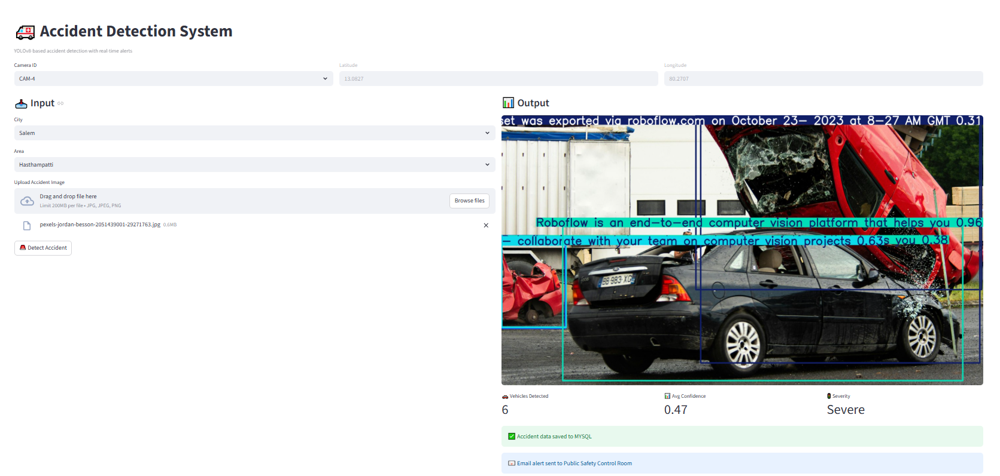
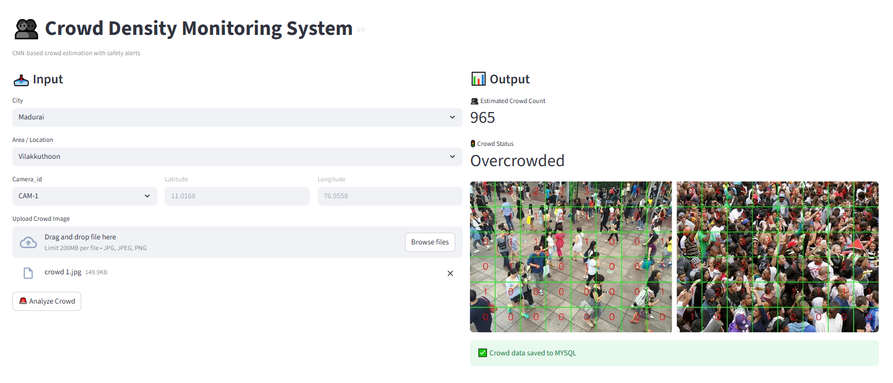
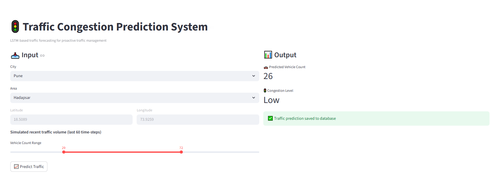
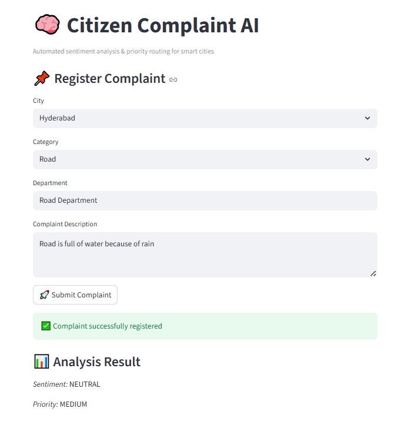
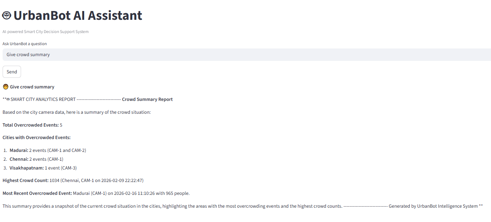

🏙️ UrbanBot Intelligence – Smart City Analytics Platform
UrbanBot Intelligence is an end-to-end AI-powered Smart City Intelligence System designed to monitor, analyze, and assist urban infrastructure management in real time.
It integrates Computer Vision, Deep Learning, NLP, MySQL, and LLM-based analytics into a unified Streamlit dashboard to support data-driven urban governance.

🚀 Key Highlights

🧠 Multi-AI System (Computer Vision + Time Series + NLP + LLM)

📊 Unified Smart City Monitoring Dashboard

🗄️ MySQL (RDS-ready) structured logging

📧 Automated email alerts for critical incidents

🤖 LLM-powered SQL + RAG chatbot assistant

☁️ Cloud-ready AWS architecture

🧩 Core Modules
Accidents
Traffic congestion
Crowd hotspots
AQI trends
Complaint sentiment

1️⃣ Unified City Intelligence Dashboard
Centralized command center displaying:

2️⃣ Accident Detection System (YOLOv8)

Upload accident images
Severity classification
Confidence scoring
MySQL logging
Alert triggering

3️⃣ Road Damage Detection

Pothole & crack detection
Infrastructure severity tagging
Maintenance planning support

4️⃣ Crowd Density Monitoring (CNN)

Crowd count estimation
Congestion risk levels
Event monitoring support

5️⃣ Traffic Congestion Forecasting (LSTM)

AI-powered traffic prediction system using Long Short-Term Memory (LSTM) networks to forecast congestion trends.
Time-series vehicle flow prediction
Congestion level forecasting
Peak-hour pattern detection
Alert generation for heavy traffic zones
Historical trend visualization with confidence intervals

6️⃣ Air Quality Forecasting (LSTM / ARIMA)

Pollutant-based AQI prediction
Location-based health classification
Trend visualization

7️⃣ Citizen Complaint Analysis (NLP)

Sentiment classification
Priority routing
Text-based issue categorization

8️⃣ UrbanBot AI Chat Assistant (LLM + RAG)

Natural language database queries
Insight generation
Smart urban recommendations

🛠️ Tech Stack
Frontend: Streamlit
Backend: Python
Computer Vision: YOLOv8 (Ultralytics)
Deep Learning: TensorFlow / PyTorch
Time Series: LSTM / ARIMA
NLP: Sentiment Analysis
LLM: SQL Agent + RAG
Database: MySQL
Cloud: AWS (EC2, S3, RDS, SES)

☁️ Cloud Deployment Architecture

AWS EC2 → Streamlit Hosting
AWS S3 → Model Storage
AWS RDS → MySQL Database
AWS SES → Automated Alerts

👩‍💻 Author

Rani

AI Engineer | Smart City Analytics | Computer Vision | NLP | Cloud Deployment

